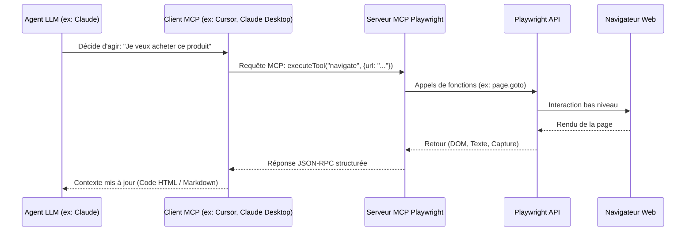

# Playwright avec Python — Guide Complet d'Automatisation, de Scraping et d'AI Engineering

> **Documentation de Référence** · `pip install playwright` · Playwright Python
>
> Ce document est un guide exhaustif conçu pour les développeurs Python, AI Engineers et Data Engineers afin de maîtriser Playwright, depuis ses concepts d'architecture interne jusqu'à son intégration avancée dans les agents IA et l'écosystème MCP (Model Context Protocol).

---

## Table des Matières

- [1. Introduction à Playwright](#1-introduction-à-playwright)
- [2. Pourquoi Playwright a été créé (Limitations des anciennes solutions)](#2-pourquoi-playwright-a-été-créé-limitations-des-anciennes-solutions)
- [3. Architecture interne de Playwright](#3-architecture-interne-de-playwright)
- [4. Concepts fondamentaux](#4-concepts-fondamentaux)
- [5. Architecture Browser Context : L'Innovation Majeure](#5-architecture-browser-context--linnovation-majeure)
- [6. Auto-Waiting (La gestion intelligente de l'asynchronisme)](#6-auto-waiting-la-gestion-intelligente-de-lasynchronisme)
- [7. Locators et Sélecteurs Robustes](#7-locators-et-sélecteurs-robustes)
- [8. Interception Réseau (Network Interception)](#8-interception-réseau-network-interception)
- [9. Tracing, Debugging et Observabilité](#9-tracing-debugging-et-observabilité)
- [10. Exécution parallèle et Scalabilité](#10-exécution-parallèle-et-scalabilité)
- [11. Comparaison Détaillée : Playwright vs Selenium](#11-comparaison-détaillée--playwright-vs-selenium)
- [12. Playwright dans l'écosystème de l'Intelligence Artificielle](#12-playwright-dans-lécosystème-de-lintelligence-artificielle)
- [13. Intégration de Playwright avec le Model Context Protocol (MCP)](#13-intégration-de-playwright-avec-le-model-context-protocol-mcp)
- [14. Cas d'usage concrets pour un AI Engineer](#14-cas-dusage-concrets-pour-un-ai-engineer)
- [15. Quand utiliser Playwright (Tableau de décision)](#15-quand-utiliser-playwright-tableau-de-décision)
- [16. Quand ne pas utiliser Playwright](#16-quand-ne-pas-utiliser-playwright)
- [17. Installation et Configuration Rapide](#17-installation-et-configuration-rapide)
- [18. Écosystème Multi-Langages de Playwright](#18-écosystème-multi-langages-de-playwright)
- [19. Ressources Officielles et Communauté](#19-ressources-officielles-et-communauté)
- [20. Conclusion](#20-conclusion)

---

## 1. Introduction à Playwright

### Définition
**Playwright** est une bibliothèque open-source et multi-plateforme permettant d'automatiser les navigateurs web modernes (Chromium, Firefox et WebKit) à l'aide d'une API unique, rapide, stable et performante. Il prend en charge l'exécution synchrone et asynchrone (via `asyncio` en Python).

### Historique et Créateurs
Lancé par **Microsoft** en 2020, Playwright a été développé par l'équipe qui a initialement créé *Puppeteer* chez Google. Insatisfaits des limites de Puppeteer (qui était restreint à Chrome/Chromium et à Node.js), ces ingénieurs ont rejoint Microsoft pour concevoir un outil universel, multi-navigateur, multi-langage, et nativement adapté aux applications web modernes et hautement dynamiques.

### Philosophie du projet
La philosophie de Playwright repose sur quatre piliers :
1. **Fiabilité absolue par défaut** : Élimination des tests ou des scripts instables (*flaky*) grâce à un mécanisme d'attente automatique (*auto-waiting*) et des sélecteurs résilients.
2. **Vitesse et efficacité** : Utilisation d'une communication bidirectionnelle ultra-rapide via WebSocket plutôt que le protocole HTTP classique de WebDriver.
3. **Isolation totale et légère** : Possibilité de créer des centaines de sessions de navigation isolées et indépendantes (les *Browser Contexts*) en quelques millisecondes sans la surcharge de lancer plusieurs instances de navigateurs complets.
4. **Alignement avec le Web moderne** : Support natif du multi-fenêtrage, des shadow DOMs, du bypass d'IFrames, du tracking réseau et de la géolocalisation.

### Problèmes résolus
* **Le fléau des scripts instables** : Fini les `time.sleep()` arbitraires qui ralentissent les scripts et échouent dès que le réseau ralentit.
* **Le cauchemar des configurations de drivers** : Plus besoin de télécharger ou de synchroniser manuellement les binaires comme `chromedriver` ou `geckodriver`. Playwright installe des versions patchées des moteurs de rendu (`Chromium`, `Firefox`, `WebKit`) parfaitement compatibles avec sa version d'API.
* **L'accès difficile au Shadow DOM et aux IFrames** : Playwright traverse nativement les frontières des composants Web modernes sans nécessiter de switch manuel de contexte complexe.

---

## 2. Pourquoi Playwright a été créé (Limitations des anciennes solutions)

L'automatisation web a historiquement évolué en trois grandes vagues. Comprendre ces vagues permet de saisir la supériorité technique de Playwright.

```
┌───────────────────────────┐     ┌───────────────────────────┐     ┌───────────────────────────┐
│        Selenium           │ ──> │        Puppeteer          │ ──> │        Playwright         │
│ (HTTP WebDriver / Lent)   │     │(DevTools Prot. Chrome-only│     │ (Multi-Browsers / WebSocket)│
└───────────────────────────┘     └───────────────────────────┘     └───────────────────────────┘
```

### Selenium (La 1ère génération)
Créé en 2004, Selenium est le pionnier. Cependant, son architecture souffre de lourdeurs :
* **Latence HTTP** : Chaque interaction (clic, recherche d'élément) effectue une requête HTTP REST via un WebDriver vers le navigateur. Sur un script complexe, ces aller-retours accumulent une latence énorme.
* **Attentes passives** : Selenium ne sait pas si un élément est prêt à recevoir un clic. Le développeur doit coder lui-même des logiques complexes de `WebDriverWait` sous peine de voir son code planter de manière imprévisible (`NoSuchElementException`, `ElementNotInteractableException`).
* **Surcharge mémoire** : Gérer plusieurs sessions nécessite d'ouvrir plusieurs instances physiques du navigateur, saturant rapidement le CPU et la RAM.

### Puppeteer (La 2ème génération)
Développé par Google, Puppeteer a introduit la communication directe via le protocole **CDP (Chrome DevTools Protocol)** en WebSocket.
* **Avantage** : Connexion instantanée, écoute d'événements réseau en temps réel, exécution beaucoup plus rapide.
* **Limitations majeures** : Limité au moteur Chromium (Google Chrome / Edge) et originellement exclusif à l'écosystème Node.js/JavaScript. Pas de support natif pour Firefox ou WebKit (Safari).

### Cypress (L'alternative in-browser)
Cypress s'exécute directement *à l'intérieur* de la page web sous forme de JavaScript.
* **Avantage** : Excellente intégration pour les tests frontend.
* **Limitations** : Tourne dans le bac à sable (sandbox) du navigateur, ce qui l'empêche de manipuler plusieurs onglets en même temps, de gérer facilement les domaines tiers, ou d'interagir nativement avec le système d'exploitation (téléchargements complexes, authentification OS).

---

## 3. Architecture interne de Playwright

L'architecture de Playwright est conçue pour maximiser la vitesse et réduire les couches intermédiaires.

### Les Composants Clés
1. **API Client (Votre Code Python)** : Le script Python qui définit les scénarios d'automatisation. Il communique avec le driver Playwright.
2. **Playwright Driver** : Un serveur Node.js léger empaqueté dans la bibliothèque. Ce driver sert de passerelle.
3. **Communication bidirectionnelle (WebSocket / gRPC-like pipe)** : Contrairement à Selenium qui utilise des requêtes HTTP REST unitaires, Playwright utilise une connexion persistante. Toutes les commandes et événements (chargement de page, requêtes réseau) transitent instantanément sous forme de messages JSON.
4. **Moteurs de rendu patchés (Browsers)** : Playwright pilote directement les API internes des navigateurs (CDP pour Chromium, protocoles similaires adaptés pour Firefox et WebKit) via des builds optimisés pour l'automatisation.

```mermaid
graph TD
    A[Code Python / Script IA] <-->|Appels d'API Synch/Asynch| B[Playwright Python Wrapper]
    B <-->|Communication via Pipe STDIO/JSON| C[Playwright Driver (Node.js Engine)]
    C <-->|WebSocket / Connexion Bidirectionnelle| D[Navigateurs patchés]
    
    subgraph Navigateurs
        D --> E[Chromium]
        D --> F[Firefox]
        D --> G[WebKit / Safari]
    end
```

### Isolation et gestion des sessions
Plutôt que de relancer un processus de navigateur complet pour chaque tâche, le Driver Playwright maintient une seule instance de navigateur active et génère des **Browser Contexts** ultra-légers. Chaque contexte possède son propre espace de cookies, de stockage local et de cache, simulant une session de navigation totalement privée ("Incognito") en une fraction de seconde.

---

## 4. Concepts fondamentaux

Comprendre les objets clés de Playwright est indispensable pour écrire des scripts d'automatisation performants.

| Concept | Description | Analogie |
| :--- | :--- | :--- |
| **Browser** | Représente une instance physique du navigateur (ex: un processus Chromium en tâche de fond). | L'application Chrome installée sur votre PC. |
| **Browser Context** | Session isolée au sein du Browser. Très rapide à créer, consomme peu de ressources. | Une fenêtre de navigation privée (Incognito). |
| **Page** | Un onglet ou une fenêtre spécifique dans un Browser Context. | Un onglet ouvert dans votre navigateur. |
| **Locator** | Abstraction représentant un élément du DOM qui se ré-évalue dynamiquement à chaque interaction. | Une cible intelligente pointée en temps réel. |
| **Selector** | La chaîne de caractères ou le pattern de recherche utilisé pour identifier un Locator. | Les coordonnées ou critères de recherche (ex: `text="Valider"`). |

### Concepts Avancés
* **Auto-waiting** : Playwright vérifie que l'élément ciblé est visible, stable (pas d'animation en cours), activé et prêt à recevoir l'action avant d'interagir avec lui.
* **Assertions** : Des vérifications intelligentes et asynchrones qui attendent automatiquement que la condition requise soit remplie (ex: `expect(locator).to_be_visible()`).
* **Fixtures** : Environnements de test préconfigurés, largement utilisés avec le framework de test Playwright.
* **Tracing** : Enregistrement complet d'une exécution (vidéo, screenshots, timeline des requêtes réseau, logs console) visualisable a posteriori dans le *Trace Viewer*.
* **Storage State** : Exportation de l'état d'authentification (cookies et localStorage) sous forme de fichier JSON pour réutiliser une session connectée ultérieurement sans repasser par l'étape de login.
* **Network Interception** : Capacité d'intercepter, modifier, rediriger ou simuler les requêtes HTTP/HTTPS émises par la page.
* **Events** : Écouteurs d'événements du navigateur (popups, crashs de page, requêtes réseau, erreurs JS).
* **Downloads / Uploads** : Gestion simplifiée des téléchargements et téléversements de fichiers sans nécessiter de dialogue système natif.

---

## 5. Architecture Browser Context : L'Innovation Majeure

Dans Selenium, pour faire du parallélisme ou isoler des tâches, il faut instancier plusieurs instances de `WebDriver`. Cela implique de lancer plusieurs processus de navigateurs réels (par exemple, 5 instances de Chrome). L'impact sur la RAM et le CPU est désastreux.

### L'approche de Playwright : Les Browser Contexts
Playwright introduit une séparation stricte entre le **Browser** (le processus lourd) et les **Browser Contexts** (les sessions logiques).

```
┌────────────────────────────────────────────────────────────────────────┐
│                        Browser (Processus Chromium)                    │
├────────────────────────────────────────────────────────────────────────┤
│                                                                        │
│  ┌───────────────────────┐ ┌───────────────────────┐ ┌──────────────┐  │
│  │ Context 1 (Session A) │ │ Context 2 (Session B) │ │  Context...  │  │
│  │  - Cookies A          │ │  - Cookies B          │ │  - Cookies   │  │
│  │  - Cache A            │ │  - Cache B            │ │  - Cache     │  │
│  │                       │ │                       │ │              │  │
│  │  ┌─────────────────┐  │ │  ┌─────────────────┐  │ │  ┌────────┐  │  │
│  │  │ Onglet (Page 1) │  │ │  │ Onglet (Page 2) │  │ │  │ Page   │  │  │
│  │  └─────────────────┘  │ │  └─────────────────┘  │ │  └────────┘  │  │
│  └───────────────────────┘ └───────────────────────┘ └──────────────┘  │
└────────────────────────────────────────────────────────────────────────┘
```

#### Avantages techniques :
1. **Isolation** : Un contexte ne peut jamais accéder aux cookies, au localStorage ou à l'historique d'un autre contexte. C'est idéal pour scraper le même site web avec différents comptes utilisateurs en parallèle.
2. **Rapidité de création** : Créer un contexte prend moins de **10 millisecondes**.
3. **Consommation mémoire minime** : Plusieurs dizaines de contextes partagent le même processus de navigateur parent sans surcharger la machine.
4. **Parallélisme massif** : On peut instancier un unique `Browser` puis distribuer les tâches sur 20 `Browser Contexts` concurrents sur une machine standard.

---

## 6. Auto-Waiting (La gestion intelligente de l'asynchronisme)

L'un des plus grands défis de l'automatisation web réside dans le timing. Les pages web modernes chargent le contenu de façon asynchrone (appels AJAX, rendu JS décalé, animations).

### La fausse bonne idée : `time.sleep()`
L'utilisation de pauses statiques (`time.sleep(5)`) rend les scripts lents (si l'élément charge en 100ms, on perd 4,9 secondes) et fragiles (si le site prend exceptionnellement 6 secondes à charger, le script plante).

### Les Waits traditionnels
* **Implicit Waits (Selenium)** : Dit au driver de chercher un élément pendant X secondes avant de lever une erreur. Insuffisant si l'élément est présent dans le DOM mais encore invisible ou masqué par une animation de chargement.
* **Explicit Waits (Selenium)** : Nécessite l'écriture de blocs de code complexes pour définir des conditions de visibilité ou d'interactivité.

### La stratégie intelligente de Playwright
Avant d'effectuer une action (clic, saisie de texte, survol), Playwright exécute automatiquement une série de **vérifications d'actionabilité** (*Actionability Checks*) sur l'élément cible :

```mermaid
flowchart TD
    A[Appel de locator.click()] --> B{Présent dans le DOM ?}
    B -- Non --> C[Attendre/Rechercher]
    B -- Oui --> D{Visible à l'écran ?}
    D -- Non --> C
    D -- Oui --> E{Stable pas d'animation ?}
    E -- Non --> C
    E -- Oui --> F{Reçoit les événements / Non masqué ?}
    F -- Non --> C
    F -- Oui --> G{Activé Enabled ?}
    G -- Non --> C
    G -- Oui --> H[Exécuter l'action click !]
```

Si ces conditions ne sont pas validées dans le temps imparti (30 secondes par défaut), Playwright lève une exception descriptive. Cela évite plus de 90 % des erreurs classiques d'automatisation.

---

## 7. Locators et Sélecteurs Robustes

Les **Locators** sont l'API centrale pour cibler des éléments dans Playwright. Ils représentent une requête de recherche dynamique dans la page.

### Pourquoi ils sont plus robustes que XPath / CSS sélecteurs bruts
Les sélecteurs basés sur la structure HTML pure (comme `/html/body/div[2]/div[1]/form/input`) se brisent à la moindre mise à jour du design ou de la mise en page d'un site.
Playwright encourage l'utilisation de sélecteurs orientés **accessibilité** et **intentions de l'utilisateur**, rendant le code résilient au changement de structure HTML.

### Les méthodes principales de Locators

```python
# 1. Cibler par rôle sémantique (Recommandé par l'accessibilité W3C)
page.get_by_role("button", name="Se connecter")

# 2. Cibler par contenu textuel exact ou partiel
page.get_by_text("Bienvenue sur votre espace")

# 3. Cibler via l'association sémantique d'un label de formulaire
page.get_by_label("Adresse e-mail")

# 4. Cibler via le texte indicatif d'un champ
page.get_by_placeholder("Entrez votre mot de passe")

# 5. Cibler via un attribut dédié aux tests et à l'automatisation (Bonne pratique)
page.get_by_test_id("submit-login-button")

# 6. Sélecteur CSS ou XPath classique en dernier recours
page.locator("div.container > input#email-field")
```

---

## 8. Interception Réseau (Network Interception)

Playwright permet d'écouter, d'analyser, d'intercepter et de modifier à la volée tout le trafic réseau (HTTP/HTTPS) généré par la page web. Pour un AI Engineer, c'est un outil surpuissant.

### Fonctionnalités Clés
* **Bloquer des ressources inutiles** : Accélérez le scraping en bloquant le chargement des images, fichiers CSS, polices ou scripts de tracking publicitaire.
* **Mock d'API** : Simuler des réponses de serveurs tiers (ex: simuler un statut d'erreur 500 pour tester la résilience d'un script).
* **Mode Hors-ligne (Offline)** : Simuler une absence totale de réseau.
* **Extraction directe de payloads JSON** : Capturer les données de l'API directement à la source au lieu de parser le HTML.

### Exemple pratique de blocage de ressources et capture de JSON :

```python
import asyncio
from playwright.async_api import async_playwright

async def main():
    async with async_playwright() as p:
        browser = await p.chromium.launch(headless=True)
        context = await browser.new_context()
        page = await context.new_page()

        # Bloquer les images et les feuilles de style CSS pour économiser la bande passante
        await page.route("**/*.{png,jpg,jpeg,svg,css}", lambda route: route.abort())

        # Intercepter les requêtes API spécifiques et récupérer leur contenu
        async def handle_route(route):
            # Continuer la requête
            response = await route.fetch()
            # Lire ou modifier le contenu JSON retourné par le site
            try:
                json_data = await response.json()
                print("Données interceptées de l'API :", json_data)
            except:
                pass
            await route.fulfill(response=response)

        await page.route("**/api/v1/products/**", handle_route)
        await page.goto("https://example.com/products")
        await browser.close()

asyncio.run(main())
```

---

## 9. Tracing, Debugging et Observabilité

Le débogage de scripts d'automatisation peut être complexe lorsque tout se déroule en arrière-plan ou de façon asynchrone. Playwright propose une suite d'outils d'observabilité de premier plan.

### Le Trace Viewer
C'est un outil post-exécution complet. Il permet d'inspecter chaque étape du script avec :
* Un enregistrement vidéo de la page.
* Les snapshots du DOM (l'état exact du HTML) avant, pendant et après chaque action.
* La console du navigateur (erreurs et avertissements JS).
* L'état des requêtes réseau au moment de l'action.

```python
# Activer le Tracing dans le code Python
await context.tracing.start(screenshots=True, snapshots=True, sources=True)

# Effectuer des actions
await page.goto("https://github.com")

# Sauvegarder la trace
await context.tracing.stop(path="trace.zip")
```
*La trace peut être visionnée en exécutant : `playwright show-trace trace.zip` ou sur [trace.playwright.dev](https://trace.playwright.dev).*

### Outils de diagnostic intégrés
* **Screenshots Automatiques** : Capture de l'écran entier ou d'un élément précis au format PNG/JPEG.
* **Enregistrement Vidéo** : Enregistrement continu de la session utilisateur dans un fichier `.webm`.
* **Codegen (Générateur de code)** : Lancez un navigateur interactif qui enregistre vos actions et génère le code Python propre associé :
  ```bash
  playwright codegen https://example.com
  ```

---

## 10. Exécution parallèle et Scalabilité

La scalabilité est native dans la conception de Playwright.

### Les Workers
Playwright utilise des processus de test appelés **Workers**. Chaque Worker s'exécute dans un processus OS distinct et orchestre ses propres Browser Contexts.
* **Parallélisme** : Si vous configurez 4 workers, Playwright va exécuter 4 sessions en parallèle, divisant le temps total d'exécution par 4.
* **Isolation logicielle** : Si une page web fait planter un onglet ou un worker (fuite mémoire, erreur système), les autres workers ne sont pas affectés et continuent leur exécution.

---

## 11. Comparaison Détaillée : Playwright vs Selenium

Voici une analyse comparative technique des deux technologies leaders du marché :

| Critère | Playwright | Selenium WebDriver |
| :--- | :--- | :--- |
| **Architecture** | Connexion bidirectionnelle temps réel via **WebSocket**. | Protocole synchrone unidirectionnel **W3C HTTP REST**. |
| **Vitesse** | **Ultra-rapide**. Faible latence réseau. | **Modérée**. Latence introduite par les requêtes HTTP. |
| **Stabilité** | **Élevée** (Auto-waiting natif et vérifications d'actionabilité). | **Variable** (Nécessite la gestion manuelle des attentes complexes). |
| **Consommation RAM** | **Optimisée** grâce à la légèreté des *Browser Contexts*. | **Élevée** (Nécessite une instance de navigateur complète par session). |
| **Multi-onglets / Fenêtres**| Support natif et transparent de multiples contextes et onglets. | Complexe (Nécessite de switcher manuellement de window handle). |
| **Shadow DOM / IFrames** | Traversée native sans configuration spécifique. | Requiert un switch de contexte explicite vers chaque IFrame. |
| **Outils de Debugging** | Trace Viewer, Code Generator (Codegen), Inspector, Screenshots, Vidéos. | Limité (Principalement via des logs ou des outils de test tiers). |
| **Installation** | `pip install playwright && playwright install` (Zéro configuration externe). | `pip install selenium` (Selenium Manager gère les drivers, mais parfois instable). |
| **Expérience Développeur**| Moderne, intuitive, asynchrone native. | Historique, parfois verbeuse. |

---

## 12. Playwright dans l'écosystème de l'Intelligence Artificielle

L'AI Engineering moderne a transcendé le simple scraping de données statiques. Playwright y joue un rôle d'infrastructure fondamental.

### 1. Agents IA Autonomes (Browser Agents / Web Agents)
Des frameworks comme **LangChain**, **CrewAI**, **LlamaIndex** ou **Browser-Use** s'appuient sur Playwright pour donner des "yeux" et des "mains" aux LLM. L'agent IA utilise Playwright pour :
* Visiter des sites web complexes.
* Récupérer le contenu textuel ou l'arborescence DOM épurée pour la donner au LLM.
* Traduire des actions décidées par le LLM (ex: "Clique sur le bouton S'inscrire") en commandes Playwright (`page.click()`).

### 2. RAG (Retrieval-Augmented Generation) & Collecte de Données
Pour alimenter un pipeline RAG en temps réel avec des données fraîches, Playwright contourne les barrières du web dynamique (Single Page Applications sous React/Angular/Vue, chargements infinis par défilement) afin d'extraire la substantifique moelle d'une page avant sa vectorisation.

### 3. Génération de Données Synthétiques (Synthetic Data Generation)
En simulant des parcours utilisateurs complexes de bout en bout (création de compte, navigation, achat), Playwright génère des logs d'activité, des captures d'écran annotées et des jeux de données d'entraînement pour entraîner des modèles de vision ou des modèles de détection d'anomalies.

---

## 13. Intégration de Playwright avec le Model Context Protocol (MCP)

Le **Model Context Protocol (MCP)** est un standard ouvert introduit par **Anthropic** pour permettre aux LLM d'interagir en toute sécurité avec leur environnement local, leurs bases de données, et leurs outils tiers via un protocole structuré.

### Qu'est-ce que Playwright MCP ?
C'est un serveur MCP packagé qui expose les capacités de Playwright (naviguer, cliquer, taper du texte, extraire du contenu) sous forme d'**outils (tools)** standardisés consommables directement par un LLM (comme Claude 3.5 Sonnet ou GPT-4o).



### Différence entre API Python classique et MCP
* **API Python classique** : Vous écrivez du code déterministe en Python. Vous devez anticiper chaque clic et chaque élément à l'avance.
* **Intégration MCP** : Le LLM reçoit la description de l'outil Playwright (ex: `click_element(selector)`). C'est le LLM qui, en analysant la structure de la page ou une capture d'écran, décide en temps réel de quel outil appeler et avec quels arguments. Cela rend l'agent dynamique et capable de s'adapter à des sites qu'il n'a jamais vus.

---

## 14. Cas d'usage concrets pour un AI Engineer

### 1. Collecte de données et Scraping dynamique
Extraction de données e-commerce, d'articles de presse ou de données financières protégées derrière des connexions ou chargées dynamiquement en JS.

```python
# Exemple d'extraction de données structurées dynamiques
import asyncio
from playwright.async_api import async_playwright

async def scrape_news():
    async with async_playwright() as p:
        browser = await p.chromium.launch(headless=True)
        page = await browser.new_page()
        await page.goto("https://news.ycombinator.com/")
        
        # Attendre que les articles soient visibles
        await page.wait_for_selector(".athing")
        
        articles = await page.locator(".athing").all()
        for article in articles[:5]:
            title = await article.locator(".titleline > a").first.text_content()
            link = await article.locator(".titleline > a").first.get_attribute("href")
            print(f"Titre: {title} | Lien: {link}")
            
        await browser.close()

asyncio.run(scrape_news())
```

### 2. Extraction d'informations visuelles pour modèles de Vision (M-LMM)
Prendre des captures d'écran partielles ou complètes et générer des coordonnées de boîte englobante (*bounding boxes*) pour entraîner des modèles de vision artificielle à comprendre les interfaces utilisateur (UI-UX layout understanding).

### 3. Agent Web auto-correcteur (Self-Healing Automation)
Création d'agents autonomes qui reçoivent une consigne en langage naturel, tentent d'exécuter l'action via Playwright, lisent le message d'erreur si l'élément n'est pas trouvé, puis demandent à un LLM de corriger le sélecteur à la volée.

---

## 15. Quand utiliser Playwright (Tableau de décision)

| Situation | Playwright recommandé ? | Pourquoi |
| :--- | :---: | :--- |
| **Site Web SPA dynamique (React, Vue, Angular)** | **Oui** | Playwright attend automatiquement le chargement et le rendu des éléments JavaScript. |
| **Extraction de données massives derrière Login** | **Oui** | La gestion du `Storage State` permet de sauter la phase de login à chaque démarrage. |
| **Scraping haute performance de pages statiques** | **Non** | Utiliser des requêtes HTTP directes (`requests`, `httpx`) est 10 à 50 fois plus rapide et moins coûteux. |
| **Tests E2E sur plusieurs navigateurs en parallèle**| **Oui** | L'architecture multi-navigateur et les workers natifs réduisent le temps total d'exécution. |
| **Bypass de systèmes anti-bots avancés (Cloudflare)** | **Mitigé** | Nécessite des extensions tierces comme `playwright-stealth` car les navigateurs automatisés par défaut sont vite détectés. |

---

## 16. Quand ne pas utiliser Playwright

1. **Lorsque le site propose une API publique ou privée accessible** : Il est toujours préférable de requêter directement l'API en JSON plutôt que de charger un navigateur complet.
2. **Pour le scraping de documents statiques simples** : Si le contenu HTML est servi directement par le serveur sans rendu JS, un combo `httpx` + `BeautifulSoup` ou `Selectolax` sera nettement plus léger, rapide et moins coûteux en ressources.
3. **Sur des machines très limitées en ressources (micro-instances Cloud)** : Lancer des moteurs de rendu web comme Chromium, même sans interface graphique (*headless*), nécessite au minimum 512 Mo à 1 Go de RAM dédié.

---

## 17. Installation et Configuration Rapide

Playwright s'installe de manière extrêmement simple en deux étapes :

### 1. Installation de la bibliothèque Python
```bash
pip install playwright
```

### 2. Téléchargement des navigateurs requis
Cette commande télécharge automatiquement les versions adaptées et sécurisées de Chromium, Firefox et WebKit.
```bash
playwright install
```

### 3. Vérification de bon fonctionnement
```bash
# Vérifier la version installée
playwright --version

# Lancer un test d'ouverture et de capture rapide
python -c "
from playwright.sync_api import sync_playwright
with sync_playwright() as p:
    browser = p.chromium.launch()
    page = browser.new_page()
    page.goto('https://playwright.dev')
    print('Titre de la page :', page.title())
    browser.close()
"
```

---

## 18. Écosystème Multi-Langages de Playwright

Bien que particulièrement populaire en Python pour l'IA et le Data Engineering, Playwright est un outil universel supporté officiellement dans plusieurs langages :

* **Playwright Node.js / JavaScript / TypeScript** : L'API de référence, souvent en avance d'une version mineure, très utilisée dans l'écosystème web moderne.
* **Playwright Python** : Support complet des modes synchrone et asynchrone, idéal pour le Machine Learning et les notebooks Jupyter.
* **Playwright Java** : Intégration forte dans les architectures d'entreprise traditionnelles.
* **Playwright .NET (C#)** : Parfaitement adapté à l'écosystème Microsoft.

---

## 19. Ressources Officielles et Communauté

* **Documentation officielle** : [playwright.dev/python/](https://playwright.dev/python/)
* **Dépôt GitHub** : [github.com/microsoft/playwright-python](https://github.com/microsoft/playwright-python)
* **Blog Playwright** : [dev.to/playwright](https://dev.to/playwright)
* **Discord officiel** : [aka.ms/playwright-discord](https://aka.ms/playwright-discord)

---

## 20. Conclusion

Playwright s'est imposé comme le nouveau standard de l'automatisation de navigateurs en balayant les défauts historiques de Selenium et la limitation mono-plateforme de Puppeteer. Sa gestion intelligente des sessions via les Browser Contexts et sa résilience native grâce à l'Auto-waiting en font une brique logicielle indispensable pour les architectures de données modernes.

Pour un **AI Engineer**, maîtriser Playwright n'est pas seulement une compétence de test de qualité (QA) ; c'est le socle fondamental permettant d'interfacer les LLM et les Agents Intelligents avec le Web réel. Comprendre son fonctionnement de base, ses locators et ses flux d'événements réseau est une étape incontournable avant d'aborder des architectures complexes de type **Playwright MCP**, où le modèle d'IA prend directement le contrôle du navigateur pour naviguer en autonomie sur Internet.
